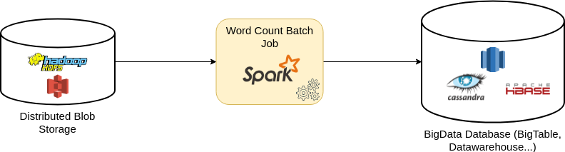
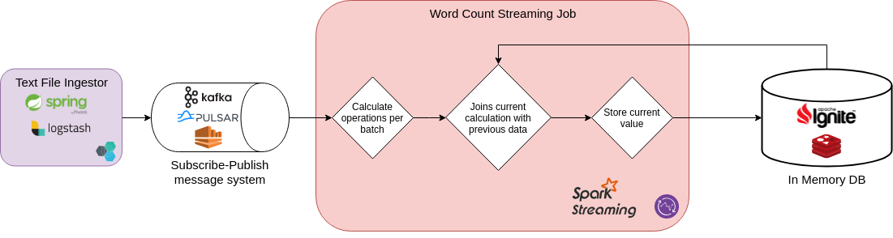

# Word Count Tech Challenge

This project contains the solution of a word count challenge based on a [Shakespeare dataset](http://lexically.net/downloads/corpus_linguistics/ShakespearePlaysPlus.zip):
- _WordCountJob_: it is a spark Batch Job job that
   - Read files from a folder of text files from the dataset
   - Filter and trim the lines
   - Calculates:
     - Top 5 most common words.
     - Top 5 longest phrases.
     - Top 5 longest words. 
     - Some text statistics: total files processed, total processed lines and the total number of words
- _WordCountStreamingJob_: it is a streaming Batch Job job that
   - Read lines/phrases from a Kafka topic
   - Filter and trim the lines
   - Calculates of the current operations for every batch:
     - Top 5 most common words.
     - Top 5 longest phrases.
     - Top 5 longest words. 
   - Updates the historic stored in Apache Ignite using the current value of the batch.

## Assumptions

There are some assumptions in order to solve the challenge:

- All empty lines or those which begin with character "<" are omitted.
- Every not omitted line is considered as phrase. 
- The tabular character si removed. 

## Proposed solution

### Batch Job

The proposed solution for the batch job is the following one:



- Files are stored in a distributed BLOB storage such as S3 or HDFS.
- WordCountJob Spark job is executed in a Spark cluster.
- Results are stored in a high-scalable database. Some example could be Cassandra, HBase or Redshift.

### Streaming Job

The proposed solution for the streaming job is the following one:



- Text files are send to a Subscribe-Publish message system such as Kafka or Kinesis.
- WordCountStreamingJob Spark job is executed in a Spark cluster.
- Calculations are performed by batch and joined with their historical values stored in the database. In order to increase the performance, a in-memory datastore is used such as Ignite or Redis. However, the DBs selected in the batch solution are still valid.
- Merged results are stored in the database.

## Implemented solution

### WordCountJob

The solutions implemented for the batch job is the following one:

- Files are stored in a local directory.
- Files are read by line/paragraph
- All invalid paragraphs are removed and valid ones are trimmed. This RDD is cached to improve performance.
- Create an RDD with the length of all distinct lines.
- Split the paragraphs into lowercase words. This RDD is cached to improve performance.
- Create an RDD with the length of all distinct words.
- Create an RDD with the count of the words using a simple map/reduceByKey operation.
- Sort all RDDs and take the X bigger values.
- Print results to the console.

> Caching is used and it can be configured. If the dataset is extremely big, the caching would have to be disabled. 

### WordCountStreamingJob

The solutions implemented for the streaming job is the following one:

- Read from a Kafka topic the lines/paragraphs.
For each batch:
- All invalid paragraphs are removed and valid ones are trimmed.
- Create an RDD with the length of all distinct lines and store values to Ignite.
- Split the paragraphs into lowercase words.
- Create an RDD with the length of all distinct words and store values to Ignite.
- Create an RDD with the count the words using a simple map/reduceByKey operation, update the count with the previous value stored in Apache Ignite and store values to Ignite.

In order to obtain results, Apache Ignite must be queried:

``` sql
select * from "longestPhrases".INTEGER order by _VAL DESC limit 5;
select * from "longestWords".INTEGER order by _VAL DESC limit 5;
select * from "commonWords".INTEGER order by _VAL DESC limit 5;
```

> Caching is not used in the streaming solution because the batch size are usually small.

## Other solutions and improvements

Apart from the solution explained before there other approaches that can be done:

- Spark Structured Streaming can be used in order to calculate the aggregation without having to query any DB. However, there are some drawbacks:
    - Storing the state requires a lot of memory and may not scale.
    - Nowadays, Structured Streaming can only write to Kafka. So another job will be required to store the calculations in a DB.
- For decreasing the memory requirements, the solution can be modified in order to used dictionaries. So instead of processing (String) -> (Integer),  (Integer) -> (Integer) will be used. This could have a big imact.

## Getting Started

These instructions will help you to compile and run the project on your local machine for development and testing purposes.

### Prerequisites

The list of requisites to compile the project:

- JDK > 1.7
- Maven 3.X
- Docker

### Create package

``` batch
mvn clean package -DskipTests
```

### Running the tests

``` batch
mvn clean verify
```

### Running the Batch Job

``` batch
# Launch docker containers
mvn pre-integration-test -DskipTests

# Launch Job
FILES=$(pwd)/src/test/resources/test_files
java -cp target/word_count_tech_challenge-1.0-SNAPSHOT-jar-with-dependencies.jar es.alvsanand.word_count_tech_challenge.WordCountJobMain --filesPath "$FILES/*" | grep WordCountJobMain
```

### Running the Streaming Job

``` batch
# Launch docker containers
mvn pre-integration-test -DskipTests

# Launch Job 
FILES=$(pwd)/src/test/resources/test_files
java -cp target/word_count_tech_challenge-1.0-SNAPSHOT-jar-with-dependencies.jar es.alvsanand.word_count_tech_challenge.WordCountStreamingJobMain

# In other shell
sleep 5

# Send text to the kafka topic
docker exec -it $(docker ps -aqf "name=kafka") bash

cat << EOF > lines.txt
<THESEUS>	<3%>
	What say you, Hermia? be advis'd, fair maid.
	To you, your father should be as a god;
	One that compos'd your beauties, yea, and one
	To whom you are but as a form in wax
	By him imprinted, and within his power
	To leave the figure or disfigure it.
	Demetrius is a worthy gentleman.
</THESEUS>
<EGEUS>	<2%>
	Full of vexation come I, with complaint
	Against my child, my daughter Hermia.
	Stand forth, Demetrius. My noble lord,
	This man hath my consent to marry her.
	Stand forth, Lysander: and, my gracious duke,
	This man hath bewitch'd the bosom of my child:
	Thou, thou, Lysander, thou hast given her rimes,
	And interchang'd love-tokens with my child;
	Thou hast by moonlight at her window sung,
	With feigning voice, verses of feigning love;
	And stol'n the impression of her fantasy
	With bracelets of thy hair, rings, gawds, conceits,
	Knacks, trifles, nosegays, sweetmeats, messengers
	Of strong prevailment in unharden'd youth;
	With cunning hast thou filch'd my daughter's heart;
	Turn'd her obedience, which is due to me,
	To stubborn harshness. And, my gracious duke,
	Be it so she will not here before your Grace
	Consent to marry with Demetrius,
	I beg the ancient privilege of Athens,
	As she is mine, I may dispose of her;
	Which shall be either to this gentleman,
	Or to her death, according to our law
	Immediately provided in that case.
</EGEUS>
EOF

kafka-console-producer.sh --broker-list localhost:9092 --topic word-count-topic < lines.txt
exit


# Check results in Ignite using SQL
docker exec -it $(docker ps -aqf "name=ignite") bash

apache-ignite-fabric/bin/sqlline.sh -u jdbc:ignite:thin://127.0.0.1/

select * from "longestPhrases".INTEGER order by _VAL DESC limit 5;
select * from "longestWords".INTEGER order by _VAL DESC limit 5;
select * from "commonWords".INTEGER order by _VAL DESC limit 5;

exit
```